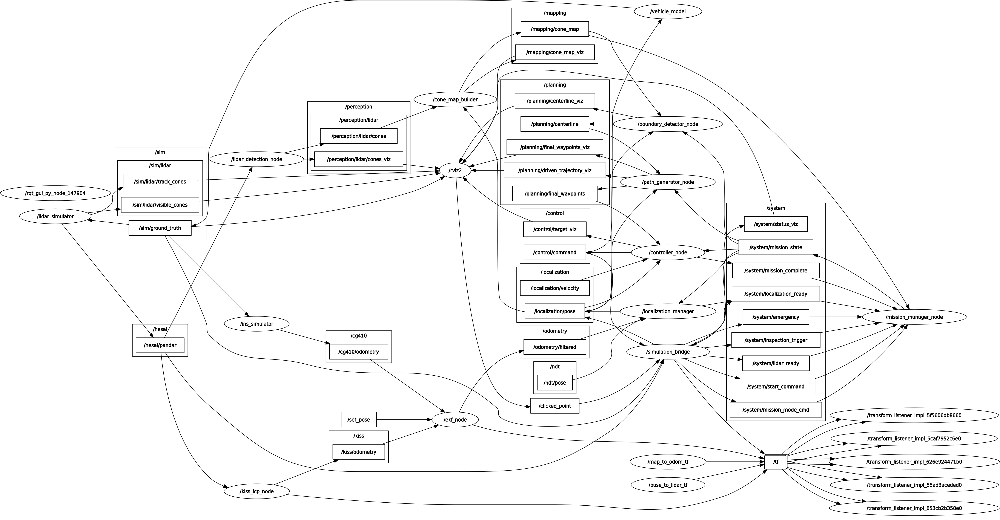

# WUTA 仿真系统

WUTA 是一套基于 ROS 2 的自动驾驶仿真系统。主仓库负责统一启动和编排，核心算法与模拟器组件分别由 Git submodule 管理。

## 已验证开发环境

以下版本来自当前维护环境，用于团队复现构建；建议其他机器使用相同的 Ubuntu 与 ROS 发行版。Python 依赖由 Ubuntu/ROS 的 APT 包管理，当前系统未依赖 `pip`。

| 项目 | 当前版本 / 要求 |
| --- | --- |
| 操作系统 | Ubuntu 22.04.5 LTS (Jammy) |
| 内核 | Linux 6.8.0-136-generic |
| ROS 2 | Humble（`ros-humble-ros-base` 0.10.0） |
| Python | Python 3.10.12 |
| CMake | 4.3.4 |
| C++ 编译器 | GCC/G++ 11.4.0，按 C++17 构建 |
| colcon | `python3-colcon-core` 0.21.0、`python3-colcon-common-extensions` 0.3.0 |
| rosdep | `python3-rosdep` 0.26.0 |

当前 Python 运行时已验证的包如下：

| 包 | 版本 | 用途 |
| --- | --- | --- |
| `rclpy` | ROS Humble APT 包 | Python ROS 2 节点 |
| `numpy` | 1.21.5 | LiDAR 仿真与数值计算 |
| `PyYAML` (`yaml`) | 5.4.1 | 赛道与启动 YAML 配置 |
| `scipy` | 1.8.0 | 仿真/分析数值工具 |
| `matplotlib` | 3.5.1 | 离线轨迹与调试绘图 |
| `pytest` | 6.2.5 | Python 单元测试 |
| `setuptools` | 59.6.0 | `ament_python` 包安装 |

FSD C++ 包还通过 `package.xml` 依赖 ROS Humble 的 `rclcpp`、`tf2_ros`、`robot_localization`、`pcl_conversions`、`Eigen3`、`yaml-cpp`、Boost、PCL、GeographicLib、TBB 和相关消息包。建议先安装 ROS 2 Humble Desktop/开发工具，再用 `rosdep` 根据源码清单安装目标机缺失依赖：

```bash
sudo rosdep init        # 仅首次需要
rosdep update

cd /path/to/WUTA
rosdep install --from-paths WUTA-FSD/ros2_ws/src WUTA-SIM \
  --ignore-src -r -y --rosdistro humble
```

在编译前可用下列命令核对关键工具；其中 `ros2` 不支持 `--version`，应通过 `ROS_DISTRO` 确认发行版：

```bash
source /opt/ros/humble/setup.bash
echo "$ROS_DISTRO"      # 应输出 humble
python3 --version
cmake --version
g++ --version
colcon list
```

### Conda 环境（离线分析与 Python 测试）

根目录的 [`environment.yml`](./environment.yml) 锁定了当前已验证的数值计算、绘图和测试依赖。它适用于轨迹/赛道分析及 `pytest`，可按以下方式创建：

```bash
conda env create -f environment.yml
conda activate wuta-sim
```

不要通过 Conda 安装 `rclpy`、`tf2_ros`、PCL 或其他 ROS 2 二进制包；它们必须来自 Ubuntu 22.04 的 ROS Humble APT 安装。需要运行 `ros2 launch`、构建 C++ ROS 包或启动完整仿真时，建议退出该 Conda 环境并使用系统 Python：

```bash
conda deactivate
source /opt/ros/humble/setup.bash
```

## 目录结构

| 路径 | 说明 | 分支 |
| --- | --- | --- |
| `WUTA-FSD` | FSD 算法栈 | `小登测试` |
| `WUTA-SIM/perception_simulation` | LiDAR 感知模拟器 | `main` |
| `WUTA-SIM/vehicle_model` | 车辆模型 | `main` |
| `WUTA-SIM/can_simulator` | CAN 模拟器 | `main` |
| `WUTA-SIM/wuta-ins-simulator` | INS/CG-410 里程计模拟器 | `main` |
| `WUTA-SIM/simulator_bringup` | 模拟器统一启动包 | 主仓库目录 |

`WUTA-FSD` 内部还包含 `kiss-icp` 和 `robot_localization` 两个递归子模块。

## 节点话题图



## 克隆完整代码

WUTA 使用 Git submodule 管理 FSD 和模拟器组件。首次克隆时请使用
`--recurse-submodules`，这样会同时拉取五个子仓库以及 `WUTA-FSD` 内部的定位依赖：

```bash
git clone --recurse-submodules https://github.com/starry1N/WUTA.git
cd WUTA
```

如果已经完成普通克隆，执行以下命令补齐全部子模块：

```bash
git submodule update --init --recursive
```

更新主仓库及其已记录的子模块版本：

```bash
git pull --no-recurse-submodules
git submodule sync --recursive
git submodule update --init --recursive
```

先更新父仓库、再执行 `submodule sync`，可以正确应用 `.gitmodules` 中发生过的子模块
URL 变更，避免已有克隆继续使用本地缓存的旧地址。各子模块是独立 GitHub 仓库，主仓库的
collaborator 权限不会自动赋予对子模块的写权限；这不影响公开子模块的克隆和拉取。

主仓库当前记录的子模块包括：`WUTA-FSD`、`WUTA-SIM/perception_simulation`、
`WUTA-SIM/vehicle_model`、`WUTA-SIM/can_simulator` 和
`WUTA-SIM/wuta-ins-simulator`。其中 `WUTA-FSD` 使用 `小登测试` 分支，其余四个
子仓库使用 `main` 分支；实际代码版本由主仓库提交
中的 submodule commit 固定。

## 子模块开发与指针更新

主仓库只记录子模块的 commit 指针，不直接记录子模块内部文件。开发时应先进入对应子模块，在子模块自己的仓库中完成提交和推送，再回到主仓库提交新的指针。

### 获取最新版本

```bash
cd /path/to/WUTA
git pull --no-recurse-submodules
git submodule sync --recursive
git submodule update --init --recursive
```

`git submodule update` 会切换到主仓库记录的准确 commit，这是保证构建可复现所需要的行为。

### 在子模块中开发

以 `vehicle_model` 为例：

```bash
cd /path/to/WUTA/WUTA-SIM/vehicle_model
git switch main
# 修改代码并测试
git status
git add <修改的文件>
git commit -m "describe the change"
git push origin main
```

`WUTA-FSD` 使用 `小登测试` 分支；其余四个子模块使用 `main` 分支。不要在主仓库目录直接使用 `git add -A`，否则容易把构建产物或无关改动误加入主仓库。

### 在主仓库更新子模块指针

子模块提交推送成功后，回到主仓库并提交对应目录：

```bash
cd /path/to/WUTA
git status
git add WUTA-SIM/vehicle_model
git commit -m "update vehicle model submodule"
git push origin main
```

其他子模块对应路径如下：

```bash
git add WUTA-FSD
git add WUTA-SIM/perception_simulation
git add WUTA-SIM/vehicle_model
git add WUTA-SIM/can_simulator
git add WUTA-SIM/wuta-ins-simulator
```

一次更新多个子模块时，先检查指针变化，再统一提交：

```bash
git diff --submodule=log
git add WUTA-FSD WUTA-SIM/perception_simulation \
  WUTA-SIM/vehicle_model WUTA-SIM/can_simulator \
  WUTA-SIM/wuta-ins-simulator
git commit -m "update simulator submodules"
git push origin main
```

### 更新到远程分支最新提交

只有在确实需要升级主仓库依赖版本时，才使用 `--remote`：

```bash
git submodule update --remote --merge WUTA-FSD
git submodule update --remote --merge WUTA-SIM/perception_simulation
git submodule update --remote --merge WUTA-SIM/vehicle_model
git submodule update --remote --merge WUTA-SIM/can_simulator
git submodule update --remote --merge WUTA-SIM/wuta-ins-simulator
```

该命令只会在本地移动子模块指针；还必须执行 `git add <子模块路径>`、提交并推送主仓库，其他人才能获得更新后的版本。

### 常用状态检查

```bash
git status
git submodule foreach --recursive 'git status --short'
git diff --submodule=log
```

`simulator_bringup` 是 WUTA 仿真系统的统一 ROS 2 启动包。各模拟器仍是独立包；
本包通过包含它们各自的 launch 文件进行编排，并可选启动 WUTA-FSD Level A
闭环。默认定位链由 `ins_simulator`、KISS-ICP、EKF 和 localization_manager 组成：
INS 将 ground truth 加噪后发布 `/cg410/odometry`，KISS-ICP 从 `/hesai/pandar` 生成
`/kiss/odometry`，EKF 融合后经 localization_manager 发布 `/localization/pose`。

## 系统依赖与启动顺序

1. `vehicle_model` 先启动，接收 WUTA-FSD 的
   `autoware_msgs/msg/Command`，发布 `/sim/ground_truth`。
2. `can_simulator` 和 `lidar_sim` 在 ground truth 源启动后再启动。
3. `can_simulator`、`lidar_sim` 与 `ins_simulator` 默认启动；INS 发布模拟 CG-410
   里程计。
4. 随后默认启动 KISS-ICP、EKF 和 localization_manager，产生统一定位输出。
5. 启用 `launch_fsd` 时，WUTA-FSD 按数据流顺序启动：
   `lidar_detection` -> `cone_map_builder` -> `boundary_detector` ->
   `mission_manager` -> `path_generator` -> `controller`.

`simulation_bridge` 默认提供就绪状态以及（`auto_start:=true` 时）`/system/start_command`。
`mission_manager` 是 `/system/mission_state` 的唯一发布者，负责 READY、EXPLORE 与 FINISH 转换。
默认的 `/localization/pose` 与动态 `odom -> base_link` TF 由融合定位链发布；bridge 的真值
pose/TF 仅在 `use_ground_truth_localization:=true` 时启用。

## 构建

推荐从仓库根目录使用一键脚本。它会先调用 WUTA-FSD 自带的
`ros2_ws/build_ws.sh` 完整构建 16 个 FSD 包，再构建模拟器 overlay：

```bash
cd /path/to/WUTA
./start_simulator.sh
```

### 一键脚本参数

| 参数 | 作用 |
| --- | --- |
| 无参数 | 增量构建完整 WUTA-FSD 和模拟器，然后启动完整闭环 |
| `--clean` | 清理两个工作区后重新完整构建并启动 |
| `--build-only` | 完成构建后退出，不启动 ROS 节点 |
| `--skip-build` | 使用已有安装空间直接启动 |
| `--rviz` | 启动时同时打开 RViz2 默认可视化配置 |
| `--config PATH` | 读取 YAML 构建/启动默认参数；命令行标志与 `name:=value` 可覆盖其中任意项 |
| `-h` / `--help` | 显示脚本帮助 |
| `--` | 后续参数全部原样传给 ROS launch |

构建和启动示例：

```bash
# 默认：增量构建并启动模拟器和 WUTA-FSD
./start_simulator.sh

# 默认闭环，并同时打开 RViz2
./start_simulator.sh --rviz

# 清理两个工作区，完整重建后启动
./start_simulator.sh --clean

# 只构建，不启动
./start_simulator.sh --build-only

# 清理后只构建，用于验证完整构建
./start_simulator.sh --clean --build-only

# 使用已有构建结果启动完整闭环
./start_simulator.sh --skip-build

# 使用已有构建结果启动完整闭环，并打开 RViz2
./start_simulator.sh --skip-build --rviz

# 只启动模拟器，不启动 WUTA-FSD 算法链
./start_simulator.sh --skip-build launch_fsd:=false

# 选择赛道和任务模式
./start_simulator.sh track_file:=skidpad mission_mode:=skidpad

# Skidpad 完整闭环并打开 RViz（起点自动为 -15 m）
./start_simulator.sh --rviz track_file:=skidpad mission_mode:=skidpad

# 真值定位调试：不启动 INS、KISS-ICP 或 EKF
./start_simulator.sh --skip-build use_ground_truth_localization:=true

# 使用另一套启动默认值；命令行参数优先
./start_simulator.sh --config config/simulator_defaults.yaml \
  track_file:=skidpad mission_mode:=skidpad

# 调整依赖阶段之间的启动间隔
./start_simulator.sh startup_delay:=1.0

# 自定义车辆初始位姿
./start_simulator.sh -- \
  track_file:=/path/to/track.yaml \
  start_x:=1.0 start_y:=2.0 start_yaw:=0.5
```

手动构建时，必须先完整构建并加载 WUTA-FSD，再构建模拟器 overlay。这样
`vehicle_model` 才能找到 `autoware_msgs`：

```bash
cd /path/to/WUTA/WUTA-FSD/ros2_ws
./build_ws.sh
source install/setup.bash

cd ../../WUTA-SIM
colcon build --base-paths . --symlink-install \
  --packages-up-to simulator_bringup
source install/setup.bash
```

## 启动与参数

```bash
ros2 launch simulator_bringup simulator.launch.py
```

常用启动参数：

```bash
ros2 launch simulator_bringup simulator.launch.py launch_fsd:=false
ros2 launch simulator_bringup simulator.launch.py launch_rviz:=true
ros2 launch simulator_bringup simulator.launch.py track_file:=skidpad mission_mode:=skidpad
ros2 launch simulator_bringup simulator.launch.py startup_delay:=1.0
ros2 launch simulator_bringup simulator.launch.py use_ground_truth_localization:=true
ros2 launch simulator_bringup simulator.launch.py auto_start:=false
ros2 launch simulator_bringup simulator.launch.py \
  track_file:=/path/to/track.yaml start_x:=1.0 start_y:=2.0 start_yaw:=0.5
```

`track_file` 和 `mission_mode` 应选择同一比赛项目。若赛道起点不是原点，还需传入
一致的 `start_x`、`start_y` 和 `start_yaw`。

定位相关参数如下。`use_ground_truth_localization:=true` 是唯一推荐的“无需 INS/EKF”调试
方式：启动文件会自动关闭 INS、KISS-ICP、EKF 与 localization_manager，并由 bridge 发布
真值 `/localization/pose` 和 `map -> base_link`。不要只设置 `launch_ins:=false`，否则 EKF
失去 INS 输入；也不要只设置 `launch_localization:=false` 后启动 FSD，因为控制链将没有
`/localization/pose`。

| 场景 | 参数 | 结果 |
| --- | --- | --- |
| 默认闭环 | 不传定位参数 | INS + KISS-ICP + EKF + localization_manager，EKF 发布 `odom -> base_link` |
| 真值定位调试（不接 INS/EKF） | `use_ground_truth_localization:=true` | bridge 发布真值 pose/TF；INS 与融合定位自动关闭 |
| 仅仿真传感器/RViz | `launch_fsd:=false use_ground_truth_localization:=true` | 不启动 FSD 感知、规划、控制；保留真值传感器与 TF |

其他常用 launch 参数：`auto_start:=false` 停留在 `IDLE` 等待外部任务状态；`start_x:=auto`
会在 Skidpad 自动选用 `-15 m`、其它赛项选用 `0 m`；可用 `wheel_base`、`max_steer_angle`
和 `vehicle_dt` 覆盖车辆模型参数。

LiDAR 可见性参数 `lidar_enable_occlusion:=true` 默认模拟锥筒之间的视线遮挡：在相近方位角上，
近处锥筒会遮住远处锥筒。设为 `false` 时会忽略遮挡，FOV 和量程内的锥筒都会进入
`/hesai/pandar`，适合隔离验证规划/控制；它不影响 `map` 坐标系下的静态真值地图
`/sim/lidar/track_cones`。

### 启动默认参数配置

根目录的 [`config/simulator_defaults.yaml`](config/simulator_defaults.yaml) 是
`start_simulator.sh` 的默认参数来源。`build` 段包含 `clean`、`skip_build`、`build_only`；
`launch_arguments` 段包含当前 `simulator.launch.py` 声明的全部参数：赛道/任务、FSD、定位、
RViz、车辆模型和初始位姿。脚本不依赖 `yq` 或 PyYAML，而是使用内置的扁平 YAML 解析器。
命令行参数始终优先，例如 `track_file:=skidpad` 仅覆盖配置中的 `track_file`。使用另一份配置可传入：

```bash
./start_simulator.sh --config /path/to/simulator_defaults.yaml --rviz
```

## 图形化启动（wuta_gui 控制面板）

除命令行外，仓库内置基于 PyQt5 的图形化控制面板 `wuta_gui`，用于一键构建、调参、启动仿真，并实时查看车辆状态、比赛计时与运行日志。

### 环境要求

- Ubuntu 22.04 + ROS 2 Humble（完整功能需要，用于 ROS 话题订阅与仿真启动）
- Python 3.10+
- WUTA 项目已初始化子模块（`git submodule update --init --recursive`）
- 已完成一次构建（`./start_simulator.sh --build-only`），否则状态/计时订阅不可用

### GUI 依赖安装

面板运行必需两个 Python 库：`PyQt5`（界面）与 `PyYAML`（参数/配置）。推荐用 APT 安装（与系统 Python 一致，避免与 ROS 环境冲突）：

```bash
sudo apt update
sudo apt install -y python3-pyqt5 python3-yaml
```

实时显示车辆状态与比赛计时还依赖 ROS 2 消息接口，随环境自动提供，无需额外安装：

| 依赖 | 来源 | 用途 |
| --- | --- | --- |
| `rclpy`、`nav_msgs`、`std_msgs` | ROS 2 Humble `ros-humble-ros-base` | 订阅 `/system/*`、`/sim/*` 话题 |
| `wuta_msgs` | `WUTA-FSD` 构建产物（`WUTA-FSD/ros2_ws/install`） | `MissionState` 等自定义消息 |

中文界面推荐安装 CJK 字体，否则中文可能显示为方块/乱码：

```bash
sudo apt install -y fonts-noto-cjk    # 或 fonts-wqy-microhei
```

> 说明：GUI 使用系统 Python 即可，不需要 pip 安装；`__main__.py` 启动时会自动检查 `PyQt5`/`pyyaml` 是否缺失。

### 启动方式

在 WUTA 仓库根目录执行：

```bash
python3 -m wuta_gui
```

也可手动指定项目根目录：

```bash
python3 -m wuta_gui --wuta-root /path/to/WUTA
```

> 说明：若当前终端未 source ROS 环境，面板会自动查找 `WUTA-FSD` / `WUTA-SIM` 的构建产物并重新加载环境后启动；完全不依赖 ROS 环境时也能打开（仅状态订阅不可用）。

### 使用流程

1. **构建页面**：选择构建模式（增量 / 清理重建 / 跳过），可选"轻量构建"限制并行编译数，点击"开始构建"。
2. **调参页面**：按分类调整 78 个节点参数（Skidpad / Acceleration / Trackdrive / 路径规划 / 建图与闭环 / LiDAR 检测 / 模拟相机 / 车辆控制 / 边界配对 / 任务管理），点击"保存参数"生成配置文件（保存在 `wuta_gui/params/`）。
3. **启动页面**：
   - 选择任务模式（Trackdrive / Skidpad / Acceleration）、赛道文件；
   - 在"参数配置"下拉框中选择刚保存的参数文件；
   - 勾选"启动 RViz 可视化"与"自动发车"后点击"启动仿真"。
4. **顶栏 / 计时面板**：实时显示车速、位姿、航向、延迟，以及圈时 / 绕桩 / 直线加速计时。
5. **日志页面**：实时查看仿真输出，可导出或打开日志目录（`logs/`）。

### 参数生效机制

参数文件格式（`wuta_gui/params/*.yaml`）：

```yaml
metadata:
  description: WUTA 参数配置文件 - my_config
  format: 按节点分组，启动时由 start_simulator.sh 在 launch 阶段注入生效
parameters:
  path_generator_node:
    trackdrive.explore.max_velocity: 3.0
  controller_node:
    ld_ratio: 2.5
```

启动时，GUI 通过 `--params-file=...` 将所选文件传给 `start_simulator.sh`，脚本将其注入 `simulator_bringup` 的 launch 文件，节点**启动即带参数**，无需启动后再逐节点加载，也无需重启等待。

### 与 FSD / SIM 的解耦

GUI 与 FSD、SIM 之间只存在三类接口，可独立开发：

| 接口 | 说明 |
| --- | --- |
| `start_simulator.sh` | 唯一的构建/启动入口（GUI 通过 `bash start_simulator.sh ...` 调用） |
| ROS 话题 | `/system/*`（状态/计时/发车/急停）、`/sim/*`（真值），消息类型见 `docs/ROS_INTERFACE.md` |
| 只读数据 | 只读 SIM 赛道文件（`WUTA-SIM/perception_simulation/tracks/`）用于选择；只读 FSD/SIM 构建产物用于构建状态提示 |

所有跨仓库路径集中定义于 `wuta_gui/core/workspace.py`，调整布局时只需修改一处。GUI 自身不写入任何 FSD/SIM 文件。

### 目录结构

```
wuta_gui/
├── __main__.py            # 入口：环境检测、依赖检查、全局样式
├── core/
│   ├── modes.py           # 任务模式常量（共享）
│   ├── workspace.py       # 跨仓库路径（共享）
│   ├── launcher.py        # 仿真启动/停止/日志（复用 start_simulator.sh）
│   ├── builder.py         # 构建线程
│   └── system_subscriber.py  # ROS 话题订阅/发布（延迟导入，无 ROS 可运行）
├── ui/
│   ├── theme.py           # 全部颜色/字体/样式（唯一风格来源）
│   ├── main_window.py     # 主窗口：顶栏 + 侧边栏 + 页面切换
│   ├── status_bar.py      # 顶栏车辆状态
│   ├── timing_panel.py    # 比赛计时面板
│   └── pages/             # 构建 / 启动 / 调参 / 日志 页面
└── params/                # 参数配置文件（default_params.yaml 入库，其余忽略）
```

### 常见问题

- **未检测到 ROS 环境**：面板底栏显示 ⚠ 提示，功能受限；请先完成一次构建后重启面板。
- **参数看起来没生效**：确认启动页"参数配置"选中的是保存后的文件（而非"默认配置"）；速度/控制器类参数请观察顶栏车速或 RViz 表现。
- **调整样式**：所有颜色、字体、控件样式统一在 `ui/theme.py` 中维护。

## RViz2 可视化

推荐直接用一键脚本启动完整闭环和 RViz2：

```bash
cd /path/to/WUTA
./start_simulator.sh --rviz
```

若已经构建完成，可跳过构建：

```bash
cd /path/to/WUTA
./start_simulator.sh --skip-build --rviz
```

该命令等价于启动 `simulator_bringup` 时传入 `launch_rviz:=true`，并加载默认
RViz 配置：

```bash
ros2 launch simulator_bringup simulator.launch.py launch_rviz:=true
```

默认配置文件安装在：

```text
share/simulator_bringup/rviz/wuta_simulator.rviz
```

源码路径为：

```text
WUTA-SIM/simulator_bringup/rviz/wuta_simulator.rviz
```

默认 RViz 设置：

| Display | Topic | 用途 |
| --- | --- | --- |
| `TF` | `map -> odom -> base_link -> lidar` | 坐标系关系 |
| `Odometry` | `/sim/ground_truth` | 车辆真值位置 |
| `PointCloud2` | `/hesai/pandar` | LiDAR 仿真点云 |
| `MarkerArray` | `/sim/lidar/visible_cones` | LiDAR 当前可见锥筒 |
| `MarkerArray` | `/sim/lidar/track_cones` | 从赛道 YAML 读取的全量锥筒地图 |
| `MarkerArray` | `/perception/lidar/cones_viz` | 感知检测锥筒 |
| `MarkerArray` | `/mapping/cone_map_viz` | 建图后的全局锥筒地图 |
| `MarkerArray` | `/planning/centerline_viz` | 规划中心线 |
| `MarkerArray` | `/control/target_viz` | 控制目标/预瞄点 |

RViz 的 `Fixed Frame` 已配置为 `map`。`/hesai/pandar` 点云已配置为
`Best Effort` QoS，以匹配传感器数据发布方式。

只可视化模拟器、不启动 WUTA-FSD 算法链时：

```bash
./start_simulator.sh --skip-build --rviz launch_fsd:=false
```

此时可见的主要 topic 是 `/sim/ground_truth`、`/hesai/pandar` 和
`/sim/lidar/visible_cones`、`/sim/lidar/track_cones`；感知、建图、规划和控制相关
可视化 topic 不会发布。

也可以手动启动 RViz2：

```bash
source /opt/ros/humble/setup.bash
source /path/to/WUTA/WUTA-FSD/ros2_ws/install/setup.bash
source /path/to/WUTA/WUTA-SIM/install/setup.bash
rviz2 -d /path/to/WUTA/WUTA-SIM/install/simulator_bringup/share/simulator_bringup/rviz/wuta_simulator.rviz
```

常用检查命令：

```bash
ros2 topic list
ros2 topic hz /hesai/pandar
ros2 topic hz /perception/lidar/cones
ros2 topic hz /mapping/cone_map
ros2 topic hz /planning/centerline
ros2 run tf2_tools view_frames
```

如果 RViz 提示 `No transform from [lidar] to [map]`，先确认仿真仍在运行，并检查静态
`map -> odom`、EKF 的 `odom -> base_link`、以及静态 `base_link -> lidar`。如果只缺点云显示，检查 `/hesai/pandar` Display 的
`Reliability Policy` 是否为 `Best Effort`。
