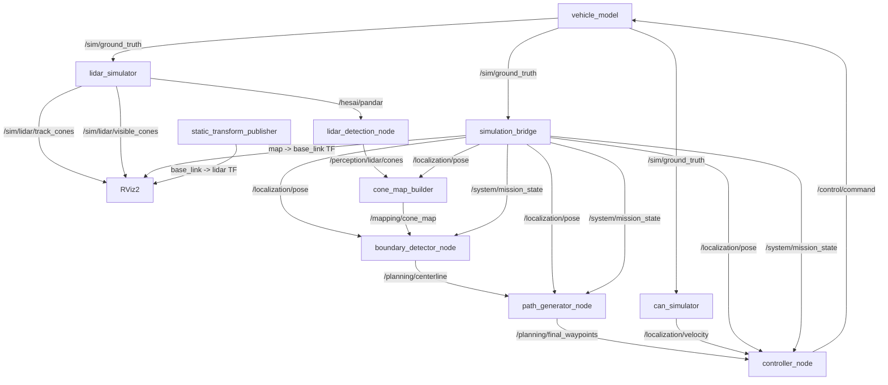

# WUTA ROS 2 系统架构

> 依据：`WUTA-SIM/simulator_bringup/launch/simulator.launch.py`、各包
> `package.xml`、`CMakeLists.txt`、`setup.py` 与节点源码。本文描述当前源码实现，
> 不把设计文档中的未来 INS、相机或 CAN 硬件实现当作已运行功能。

## 1. System Overview

WUTA 是面向 Formula Student Driverless 赛道的 ROS 2 系统。当前代码提供一个以
自行车模型、赛道 YAML 与合成 LiDAR 为输入的闭环仿真：点云经锥筒检测、锥筒地图、
边界/中心线、路径生成与 Pure Pursuit 控制后，重新驱动车辆模型。

KISS-ICP + EKF（含 INS 接入）属于**待实现的系统集成**：仓库保留 KISS-ICP、
robot_localization 源码及配置，但当前没有 INS 模拟器，也没有把该链路接入默认
bringup。NDT 组件同样不在默认 bringup。当前可运行仿真使用 `simulation_bridge` 将
真值适配成 `/localization/pose`。

能力边界：

- 赛道 YAML 读取、可见性/遮挡/噪声建模与 `PointCloud2` 合成；
- 传统 PCL 锥筒检测（DL 后端为接口占位）；
- 锥筒去重、颜色启发式、闭环检测与 YAML 保存；
- Trackdrive 的 Delaunay 中心线，以及 Skidpad/Acceleration 的解析路径；
- Pure Pursuit 命令与仿真车辆闭环；
- RViz 真值、感知、地图、中心线和控制目标可视化。

## 2. ROS 2 System Architecture

`mission_manager`、`localization_manager`、`kiss_icp_node`、`ndt_localization` 与
`map_saver` 均在源码中实现，但不由 `simulator.launch.py` 默认启动。

## 3. Node Architecture

| Node（可执行名） | Package | 默认 bringup | 职责；主要输入 → 输出 |
| --- | --- | --- | --- |
| `vehicle_model` | `vehicle_model` | 是 | 自行车模型；`/control/command` → `/sim/ground_truth` |
| `can_simulator` | `can_simulator` | 是 | 从仿真里程计复制速度；`/sim/ground_truth` → `/localization/velocity` |
| `lidar_simulator` | `lidar_sim` | 是 | YAML 赛道/车辆位姿生成点云与真值 marker；`/sim/ground_truth` → `/hesai/pandar`、`/sim/lidar/*` |
| `simulation_bridge` | `simulator_bringup` | 是 | 真值适配、状态与 TF；`/sim/ground_truth` → `/localization/pose`、状态、`map -> base_link` |
| `lidar_detection_node` | `lidar_detection` | 是（`launch_fsd`） | PCL/DL 检测；`/hesai/pandar` → `/perception/lidar/cones`、可视化 |
| `cone_map_builder_node` | `cone_map_builder` | 是（`launch_fsd`） | TF 变换、去重/闭环；检测与 pose → `/mapping/cone_map` |
| `boundary_detector_node` | `boundary_detector` | 是（`launch_fsd`） | Delaunay 中点中心线；地图、位姿、任务 → `/planning/centerline` |
| `path_generator_node` | `path_generator` | 是（`launch_fsd`） | 赛项路径与速度；中心线/位姿/任务 → `/planning/final_waypoints` |
| `controller_node` | `controller` | 是（`launch_fsd`） | Pure Pursuit 与限幅；位姿/速度/路径/任务 → `/control/command` |
| `mission_manager_node` | `mission_manager` | 否 | IDLE/READY/EXPLORE/RACE 状态机；系统状态与地图 → `/system/mission_state` |
| `localization_manager_node` | `localization_manager` | 否；KISS+EKF 集成待实现 | 预留 EKF 与 NDT 位姿源切换；状态/`/odometry/filtered`/`/ndt/pose` → `/localization/pose` |
| `kiss_icp_node` | KISS-ICP ROS package | 否；系统集成待实现 | KISS-ICP 源码节点；点云 → `kiss/odometry` 与调试点云 |
| `ndt_localization_node` | `ndt_localization` | 否 | PCL NDT 匹配；点云、初始位姿、状态 → `/ndt/pose`、路径 |
| `map_saver_node` | `ndt_localization` | 否 | 探索阶段累积/下采样点云并保存 PCD；点云、KISS odom、状态 → `/ndt/map_ready` |
| `ekf_node` / `ukf_node` / `navsat_transform_node` / `robot_localization_listener_node` | `robot_localization`（源码依赖） | 否 | 第三方滤波、地理坐标转换和监听工具；由其自身 launch 启动 |

`autoware_msgs`、`wuta_msgs` 和 `wuta_tools` 是接口/工具包，不提供节点。`camera_detection`、
`detection_fusion` 和 `kiss_icp_wrapper` 具有 package 元数据，但当前
源码树中没有由本项目 CMake/launch 暴露的可执行节点，故不列为运行节点。

## 4. Hardware / Simulation Architecture

当前默认路径是软件仿真，而非真实硬件驱动：

- 车辆：`vehicle_model` 的运动学自行车模型，轴距默认 1.53 m；
- LiDAR：`lidar_simulator` 读取 `tracks/*.yaml`，以 `lidar` frame 发布合成点云；
- 速度反馈：`can_simulator` 从真值里程计生成 `TwistStamped`；
- TF：`simulation_bridge` 发布动态 `map -> base_link`，bringup 内置
  `static_transform_publisher` 发布 `base_link -> lidar`（z=1 m）；
- INS 模拟器、CG-410 驱动及 KISS-ICP + EKF 融合链均为待实现集成；EKF 配置预期
  `/cg410/odometry`，但当前默认闭环不使用它；`mission_manager` 的 CAN 车检发送仍是 TODO。

## 5. Software Stack

| 层 | 当前实现 |
| --- | --- |
| ROS | ROS 2 Humble（工作环境与脚本均使用 `/opt/ros/humble`） |
| 客户端库 | C++ `rclcpp`；Python `rclpy` |
| 构建 | `ament_cmake`、`ament_python`、`colcon` |
| DDS | 使用 ROS 2 默认 RMW/DDS；仓库未固定某一 DDS 实现 |
| 点云/定位 | PCL、KISS-ICP 源码、robot_localization、PCL NDT |
| 可视化 | RViz2、`visualization_msgs/MarkerArray` |
| 仿真资产 | 赛道 YAML；仓库未发现 URDF、xacro、SDF 或 Gazebo world 文件 |
