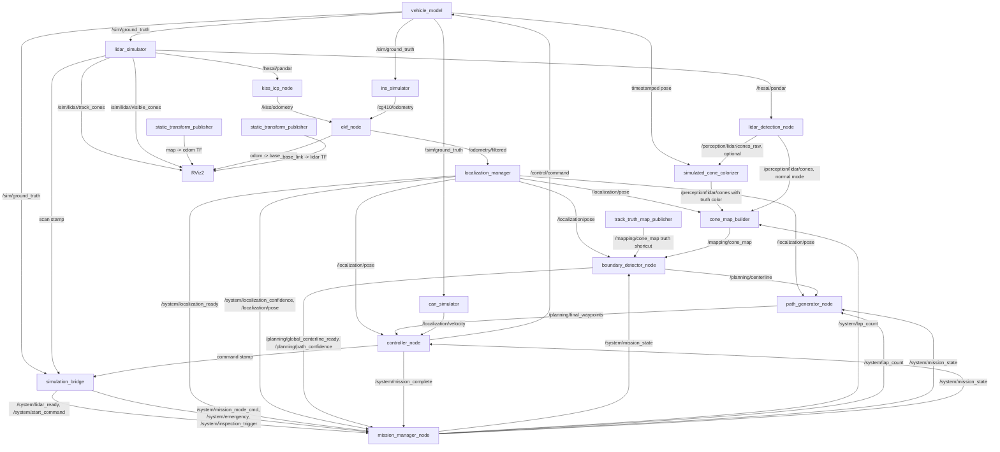

# WUTA ROS 2 系统架构

> 依据：`WUTA-SIM/simulator_bringup/launch/simulator.launch.py`、各包
> `package.xml`、`CMakeLists.txt`、`setup.py` 与节点源码。本文描述当前源码实现，
> 不把相机或 CAN 硬件实现当作已运行功能。

## 1. System Overview

WUTA 是面向 Formula Student Driverless 赛道的 ROS 2 系统。当前代码提供一个以
自行车模型、赛道 YAML 与合成 LiDAR 为输入的闭环仿真：点云经锥筒检测、锥筒地图、
边界/中心线、路径生成与 Pure Pursuit 控制后，重新驱动车辆模型。

INS 模拟器已作为默认 submodule 组件接入：它将真值加噪后发布 `/cg410/odometry`。
默认 bringup 同时启动 KISS-ICP、robot_localization EKF 与 localization_manager：KISS
处理 `/hesai/pandar`，EKF 融合 `/kiss/odometry` 和 `/cg410/odometry`，再由
localization_manager 统一发布 `/localization/pose`。NDT 组件仍不在默认 bringup。

能力边界：

- 赛道 YAML 读取、可见性/遮挡/噪声建模与 `PointCloud2` 合成；
- 传统 PCL 锥筒检测（DL 后端为接口占位）；
- 锥筒在线去重、闭环冻结前最终收敛合并、颜色启发式、闭环检测与 YAML 保存；
- Trackdrive 第一圈局部中心线、闭环地图生成的冻结全局中心线、分圈曲率限速，以及 Skidpad/Acceleration 的解析路径；
- Pure Pursuit 命令与仿真车辆闭环；
- RViz 真值、感知、地图、中心线和控制目标可视化。

## 2. ROS 2 System Architecture

```mermaid
graph TD
  VM[vehicle_model] -->|/sim/ground_truth| LS[lidar_simulator]
  VM -->|/sim/ground_truth| CAN[can_simulator]
  VM -->|/sim/ground_truth| SB[simulation_bridge]
  VM -->|/sim/ground_truth| INS[ins_simulator]
  LS -->|/hesai/pandar| LD[lidar_detection_node]
  LS -->|/hesai/pandar| KISS[kiss_icp_node]
  LS -->|scan stamp| SB
  VM -->|timestamped pose| SCC[simulated_cone_colorizer]
  KISS -->|/kiss/odometry| EKF[ekf_node]
  INS -->|/cg410/odometry| EKF
  EKF -->|/odometry/filtered| LM[localization_manager]
  LM -->|/localization/pose| CMB[cone_map_builder]
  LM -->|/localization/pose| BD[boundary_detector_node]
  LM -->|/localization/pose| PG[path_generator_node]
  LM -->|/localization/pose| CTRL[controller_node]
  LS -->|/sim/lidar/track_cones| RVIZ[RViz2]
  TTM[track_truth_map_publisher] -->|/mapping/cone_map truth shortcut| BD
  LS -->|/sim/lidar/visible_cones| RVIZ
  LD -->|/perception/lidar/cones_raw, optional| SCC
  SCC -->|/perception/lidar/cones with truth color| CMB
  LD -->|/perception/lidar/cones, normal mode| CMB
  CMB -->|/mapping/cone_map| BD
  SB -->|/system/lidar_ready, /system/start_command| MM[mission_manager_node]
  SB -->|/system/mission_mode_cmd, /system/emergency, /system/inspection_trigger| MM
  LM -->|/system/localization_ready| MM
  LM -->|/system/localization_confidence, /localization/pose| MM
  MM -->|/system/mission_state| BD
  BD -->|/planning/centerline| PG[path_generator_node]
  BD -->|/planning/global_centerline_ready, /planning/path_confidence| MM
  MM -->|/system/lap_count| CMB
  MM -->|/system/lap_count| PG
  MM -->|/system/mission_state| PG
  PG -->|/planning/final_waypoints| CTRL[controller_node]
  CAN -->|/localization/velocity| CTRL
  MM -->|/system/mission_state| CTRL
  CTRL -->|/control/command| VM
  CTRL -->|command stamp| SB
  CTRL -->|/system/mission_complete| MM
  TFSTATICMAP[static_transform_publisher] -->|map -> odom TF| RVIZ
  EKF -->|odom -> base_link TF| RVIZ
  TFSTATIC[static_transform_publisher] -->|base_link -> lidar TF| RVIZ
```

`mission_manager` 由 `simulator.launch.py` 在 `launch_fsd=true` 时启动，并且是唯一的
`/system/mission_state` 发布者。`ndt_localization` 与 `map_saver` 仍只在源码中实现，未由
默认 bringup 启动。

## 3. Node Architecture

| Node（可执行名） | Package | 默认 bringup | 职责；主要输入 → 输出 |
| --- | --- | --- | --- |
| `vehicle_model` | `vehicle_model` | 是 | 自行车模型；`/control/command` → `/sim/ground_truth` |
| `can_simulator` | `can_simulator` | 是 | 从仿真里程计复制速度；`/sim/ground_truth` → `/localization/velocity` |
| `can_interface` | `can_interface`（FSD 源码预留目录） | 否，且当前不可编译 | 规划中的实车 VCU/CAN 适配；目标是 CAN → 任务控制/车速、MissionState/车检结果 → CAN；当前没有 `package.xml`/`CMakeLists.txt`，不能视作运行节点 |
| `ins_simulator` | `ins_simulator` submodule | 是（`launch_ins=true` 且未启用真值定位） | 真值加噪的 CG-410 适配；`/sim/ground_truth` → `/cg410/odometry` |
| `lidar_simulator` | `lidar_sim` | 是 | YAML 赛道/车辆位姿生成点云与真值 marker；`/sim/ground_truth` → `/hesai/pandar`、`/sim/lidar/*` |
| `track_truth_map_publisher` | `simulator_bringup` | 仅 `launch_fsd=true` 且 `use_track_truth_map=true` | 将 YAML 锥桶坐标和正确颜色转换为 `/mapping/cone_map`，模拟相机提供可靠颜色；正式首圈完成后置 `is_closed=true`，但不发布 YAML 中心线 |
| `simulated_cone_colorizer` | `simulator_bringup` | 仅 `launch_fsd=true`、`use_track_truth_map=false` 且 `use_simulated_cone_colors=true` | 按检测时间戳和真值位姿匹配 YAML 锥桶，只把正确颜色赋给 LiDAR 检测；不发布坐标、地图或中心线 |
| `simulation_bridge` | `simulator_bringup` | 是 | 就绪、仿真开始输入、真值单圈对照计时、LiDAR→命令延迟、真值调试 pose/TF 与状态可视化；关闭真值定位时不注册 pose/TF 发布端点；不拥有 Trackdrive 圈次或 MissionState |
| `lidar_detection_node` | `lidar_detection` | 是（`launch_fsd=true` 且 `use_track_truth_map=false`） | PCL/DL 检测；`/hesai/pandar` → `/perception/lidar/cones`、可视化 |
| `cone_map_builder_node` | `cone_map_builder` | 是（`launch_fsd=true` 且 `use_track_truth_map=false`） | 精确时间 TF 变换、在线轨迹去重、颜色融合；检测、pose 与正式圈次 → 闭合 `/mapping/cone_map` |
| `boundary_detector_node` | `boundary_detector` | 是（`launch_fsd`） | EXPLORE 局部中心线；闭环后优先从蓝黄锥配对，少量侧别错误时以局部边界切向筛选横跨赛道锥桶对，排序验收并冻结全局中心线 |
| `path_generator_node` | `path_generator` | 是（`launch_fsd`） | Trackdrive 从冻结环线切取 40 m 前视段，按圈次、曲率、可见距离和置信度限速；Skidpad 固定四圈+25 m 退出路径 |
| `controller_node` | `controller` | 是（`launch_fsd`） | 带单调路径进度的 Pure Pursuit 与限幅；Skidpad/Acceleration 停车后通知任务完成 |
| `mission_manager_node` | `mission_manager` | 是（`launch_fsd`） | 唯一 MissionState 发布者；验证 RACE 门槛，用定位穿越有限起终线生成 `/system/lap_count`，第三圈后 FINISH |
| `localization_manager_node` | `localization_manager` | 是（`launch_localization=true` 且未启用真值定位） | EKF/NDT 位姿源切换；发布 `/localization/pose`、ready 与协方差派生的定位置信度 |
| `kiss_icp_node` | KISS-ICP ROS package | 是（`launch_localization=true` 且未启用真值定位） | 点云 → `/kiss/odometry`；TF 由 EKF 单独发布 |
| `ndt_localization_node` | `ndt_localization` | 否 | PCL NDT 匹配；点云、初始位姿、状态 → `/ndt/pose`、路径 |
| `map_saver_node` | `ndt_localization` | 否 | 探索阶段累积/下采样点云并保存 PCD；点云、KISS odom、状态 → `/ndt/map_ready` |
| `ekf_node` / `ukf_node` / `navsat_transform_node` / `robot_localization_listener_node` | `robot_localization`（源码依赖） | 仅 `ekf_node` 是（`launch_localization=true` 且未启用真值定位） | 第三方滤波、地理坐标转换和监听工具 |

`autoware_msgs`、`wuta_msgs` 和 `wuta_tools` 是接口/工具包，不提供节点。`camera_detection`、
`detection_fusion` 和 `kiss_icp_wrapper` 具有 package 元数据，但当前
源码树中没有由本项目 CMake/launch 暴露的可执行节点，故不列为运行节点。

仿真中 `simulation_bridge` 充当临时 VCU 输入源：它周期发布 mission mode、GO/start、
`emergency=false` 与 `inspection_trigger=false` 给 `mission_manager`。实车应由 CAN 接口替换这组
输入；`can_interface` 目前仅保留源码与配置草案，尚未进入编译或 launch。

## 4. Hardware / Simulation Architecture

当前默认路径是软件仿真，而非真实硬件驱动：

- 车辆：`vehicle_model` 的运动学自行车模型，轴距默认 1.53 m；
- LiDAR：`lidar_simulator` 读取 `tracks/*.yaml`，以 `lidar` frame 发布合成点云；
- 速度反馈：`can_simulator` 从真值里程计生成 `TwistStamped`；
- TF：bringup 发布静态 `map -> odom`（仿真中两者同原点）与 `base_link -> lidar`（z=1 m）；
  EKF 发布动态 `odom -> base_link`，因此完整链为 `map -> odom -> base_link -> lidar`；
- `ins_simulator`、KISS-ICP 与 EKF 是默认定位链；真实 CG-410 驱动仍需替换 INS 子模块。
  `mission_manager` 的 CAN 车检发送仍是 TODO。

## 5. Software Stack

| 层 | 当前实现 |
| --- | --- |
| ROS | ROS 2 Humble（工作环境与脚本均使用 `/opt/ros/humble`） |
| 客户端库 | C++ `rclcpp`；Python `rclpy` |
| 构建 | `ament_cmake`、`ament_python`、`colcon` |
| DDS | 使用 ROS 2 默认 RMW/DDS；仓库未固定某一 DDS 实现 |
| 点云/定位 | PCL、KISS-ICP 源码、robot_localization、PCL NDT |
| 可视化 | RViz2、`visualization_msgs/MarkerArray` |
| 仿真资产 | 赛道 YAML；仓库未发现 URDF、xacro、SDF 或 Gazebo world 文件 |
