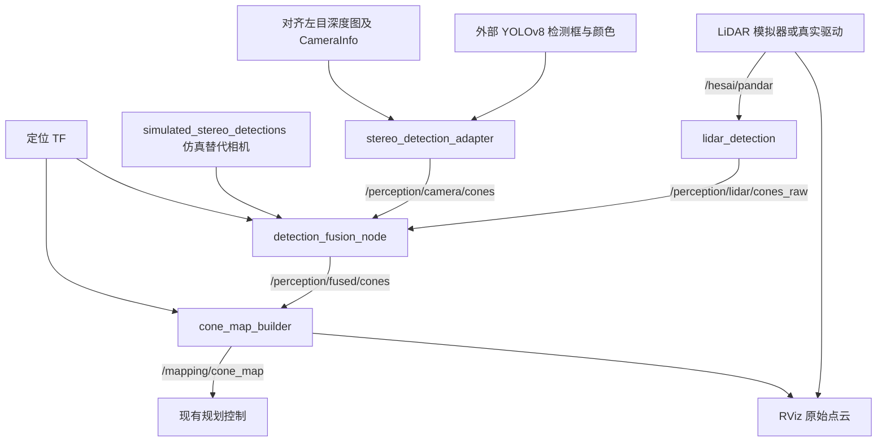

# 双目 YOLOv8 / LiDAR 后融合

## 入口与能力边界

```bash
# 独立仿真入口；默认构建，使用 INS/EKF 定位，不使用真值地图快捷输入
./start_fusion_simulator.sh --rviz
./start_fusion_simulator.sh --skip-build track_file:=track6 mission_mode:=trackdrive
# 无 GUI 验证
./start_fusion_simulator.sh --skip-build launch_rviz:=false
# 隔离定位误差的显式调试选项
./start_fusion_simulator.sh --skip-build use_ground_truth_localization:=true
```

该入口独立选择 trackdrive，不继承普通启动脚本中的赛项/真值定位默认值。
支持 `--lightweight`、`--skip-build`、`--rviz`、`--help` 及 ROS launch 参数。
脚本实际启动前会停止上一套 WUTA 系统，避免与普通仿真同时运行。RViz 显示 `/hesai/pandar` 原始输入点云、
`/mapping/cone_map_viz` 建图结果及中心线/状态；不拿 Loaded Track Cones 冒充融合地图。
这里的点云由 LiDAR 模拟器逐帧产生，不是实物雷达采集数据。

`simulated_stereo_detections` 从 YAML 和真值位姿独立生成相机检测框、颜色、带噪双目位置；
不读取 LiDAR 检测，也不直接发布 ConeMap。它是检测级模拟器，不执行 YOLO 或图像渲染。
简化模型采用矩形遮挡、固定示例内参、假设 0.5 m 安装高度及约 0.16 m 锥筒观察高度，
不能用来证明真实双目精度或特殊尺寸锥筒识别率。颜色错误/深度失效可通过参数注入。

## 数据流



实机入口已接入 ZED 2i/M1 外部驱动、PT/ONNX YOLO 推理和已有雷达相机外参，
ZED SDK 提供注册深度；硬件同步和标定精度仍需验收。融合检测不是 EKF 的新定位输入；
现有 INS/EKF 提供运动补偿和建图 TF，锥筒地图仍由 cone_map_builder 生成。

## 消息契约

新增 `wuta_msgs/msg/CameraConeDetection`：`detection_id`、`bbox_xyxy[4]`、
`color_probabilities[4]`、`confidence`、`position_valid`、`position`、
`position_covariance[9]`。数组 `CameraConeDetectionArray` 带曝光时间和左目光学帧。
颜色顺序 UNKNOWN/BLUE/YELLOW/ORANGE，框为校正后原图像素，必须撤销 YOLO letterbox/缩放。
双目位置单位米，协方差行优先、正定；位置参考为可见表面中心，不假定框中心等于底面中心。

相机适配器在检测框中央 40% 区域取有效深度中位数，检验有效比例和深度分散程度，
支持有行填充的大小端 32FC1/16UC1，深度与检测最多相差 10 ms，等待最多 50 ms。
没有深度仍输出检测框/颜色。实机注册深度由 ZED 驱动提供，项目适配器不实现原始左右图匹配。

## 关联、时间与退化

LiDAR 触发融合，以 scan 时间为输出时间，通过连续 odom 将其投影到相机曝光时刻。
不使用最新 TF，不修改采样时间；真实雷达须先扫描去畸变，驱动时钟须统一。
相机最近帧允许 60 ms 差，通用默认 LiDAR 等待相机/TF 最多 100 ms，实机覆盖为
1.2 秒，队列 20 帧；等待上限和采样时间差容差是两个独立条件。
每个相机帧最多使用一次，重复/乱序 LiDAR 不增加地图命中，回放时间重置需重启节点。

关联同时检查框投影、0.8 m 硬距离门限和三维马氏距离平方 11.345，剔除歧义行/列后
用 Hungarian 一对一匹配。不匹配相机不会创建地图地标。无深度可唯一投影匹配颜色。
初始阈值需针对实机标定。位置采用等权信息形式的保守协方差交叉融合 XY，保留 LiDAR Z，
单次位置改变量不超过 0.25 m；附加 0.15 m 参考点不确定度。硬件入口默认关闭位置融合，
完成外参、共同位置参考和误差模型标定后再开启；仿真入口开启。

输出复用现有 `ConeArray`，不传协方差/颜色完整分布；builder 仍使用命中次数位置平均。
完整协方差地图滤波尚未实现。`confidence` 保持 LiDAR 检出置信度，不冒充颜色概率。
融合模式关闭 `assign_colors`，至少 3 次颜色支持、占比 >=70% 才输出语义颜色；
几何关联不因单次颜色冲突新建重复地标，同帧共视去重保护仍在。

## 真实设备入口

ZED 2i/M1 独立实机感知使用 `./start_simulator.sh --hardware --skip-build --rviz`，
真实点云为 `/rslidar_points`，默认 GPU PT 推理。部署路径与今日验收见
[HARDWARE_FUSION.md](HARDWARE_FUSION.md)。以下通用入口仍供其他外部驱动适配：

```bash
ros2 launch detection_fusion fusion_mapping.launch.py
```

需要外部提供 `/hesai/pandar`、`/camera/yolo/cones`、
`/camera/left/depth_registered`、`/camera/left/camera_info` 和已有定位 pose/TF。
细节见 `WUTA-FSD/ros2_ws/src/perception/camera_detection/README.md` 和
`WUTA-FSD/ros2_ws/src/perception/detection_fusion/README.md`。
此入口不启动车辆控制或虚构设备驱动。

## 参数与诊断

融合参数见 `detection_fusion/config/fusion.yaml`。诊断话题 `/perception/fusion/status`
类型 `std_msgs/msg/String`，JSON 含 stamp_ns、reason、lidar_cones、matches、colored、
published_cones、unmatched_filtered、guided_clusters。`publish_unmatched_lidar=false` 时，仅发布与相机框
一对一关联成功的雷达聚类；无匹配或相机超时时发布空数组。
`camera_timeout`、`transform_unavailable`、`camera_info_missing`、
`camera_info_frame_mismatch`、`queue_overflow` 在默认兼容模式回退为 LiDAR-only UNKNOWN
观测；实机框门控模式会过滤这些未匹配观测。

实机还启用 `guided_clustering`。当相机框没有匹配到传统雷达候选时，融合节点从
同一采样时间的 `/rslidar_points` 中投影点到该框，利用有效 ZED 深度保留前后
0.4 m 的同一深度层，进行 0.05 m 体素化和 0.15 m 三维连通聚类。候选仍须满足
点数、宽度和高度限制；没有真实点簇时不会生成相机独有目标。诊断字段
`guided_clusters` 表示该路径补充的目标数。
实机颜色接受门限为 0.6，地图要求同一目标累计至少 3 次语义支持且占有效颜色票数
至少 70% 后才确认颜色，不要求连续三次。

相机模拟参数：track_file（string）、publish_rate_hz=20.0、max_range=20.0、seed=7、
depth_dropout_probability=0.05、color_error_probability=0.0。设置错误概率不模拟完整视觉模型。
相机模拟专用静态 TF `base_link -> sim_camera_left_optical_frame` 由独立入口发布。

所有感知输入采用 Best Effort/Volatile；融合输出 Reliable/Volatile depth 10。
物理部署必须额外验证错色、相邻赛段、多锥遮挡、时钟偏移、TF 缺失及相机掉线。

## 手动验收步骤

2026-09-15 已完成实机 ROS 接线、GPU YOLO、框引导原始点云聚类和 RViz 联调。
当前现场结果及剩余问题记录在 [HARDWARE_FUSION.md](HARDWARE_FUSION.md)；其中单帧
融合已观察到 BLUE 输出，但累计地图仍为 UNKNOWN，后续验收重点是时间关联吞吐和
同一地图轨迹的三次颜色确认。以下步骤继续用于仿真回归和实机复测。

1. 运行 `./start_fusion_simulator.sh --rviz`，观察原始点云和 Fused Cone Map。
   地图应逐步生成，蓝黄颜色需要至少三次支持；相机视野外 UNKNOWN 属正常退化。
2. 在 source 两层 install 的终端中执行：

   ```bash
   ros2 topic info /mapping/cone_map --verbose
   ros2 topic info /perception/fused/cones --verbose
   ros2 node info /cone_map_builder
   ros2 topic echo /perception/fusion/status
   ros2 topic echo /perception/fused/cones --once
   ros2 run tf2_ros tf2_echo base_link sim_camera_left_optical_frame
   ```

   ConeMap 应只有 cone_map_builder 发布，builder 订阅 fused/cones；
   fusion/status 的 matches/colored 在有可见锥筒时应非零，reason 不应持续为 TF 错误。
   融合消息的 frame_id/stamp 应与对应原始 LiDAR 检测一致；等待相机的耗时不改变采样时间。
3. 结束该实例，再运行：

   ```bash
   ./start_fusion_simulator.sh --skip-build simulate_camera:=false
   ```

   无相机时应持续输出 UNKNOWN 的 LiDAR 观测，status 为 camera_timeout；
   新地图不应由车辆左右启发式染色。该退化测试不保证无语义颜色时规划能完整跑圈。
4. 对照真值检查颜色错配和重复锥筒，而不是只看轨迹是否能跑；记录 rosbag 时至少包含
   `/hesai/pandar`、`/perception/lidar/cones_raw`、`/perception/camera/cones`、
   `/perception/camera/camera_info`、`/perception/fused/cones`、`/perception/fusion/status`、
   `/mapping/cone_map`、`/tf`、`/tf_static`、`/localization/pose` 与 `/sim/ground_truth`。
